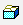
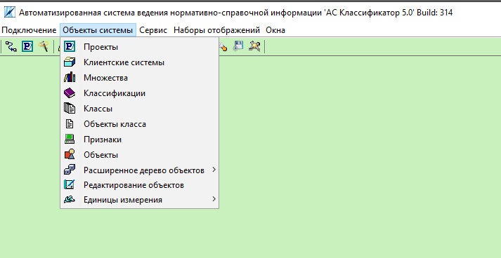
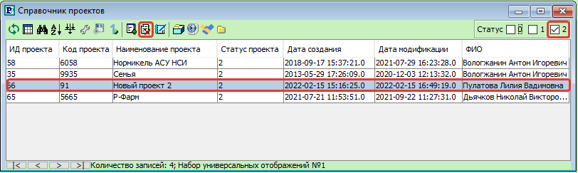
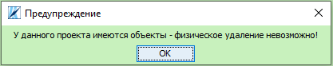
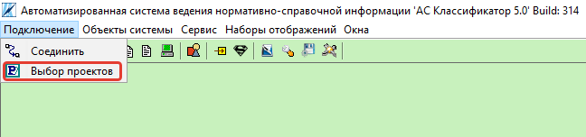
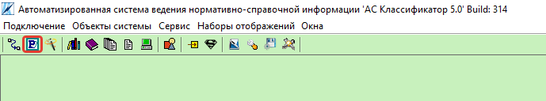
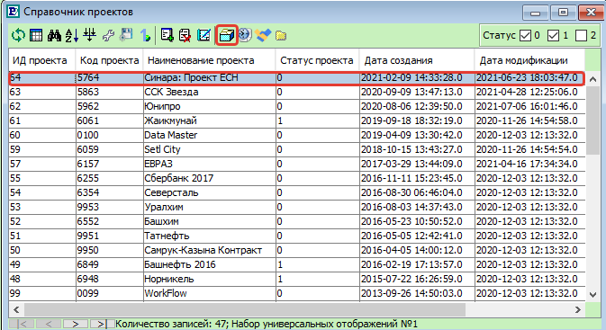
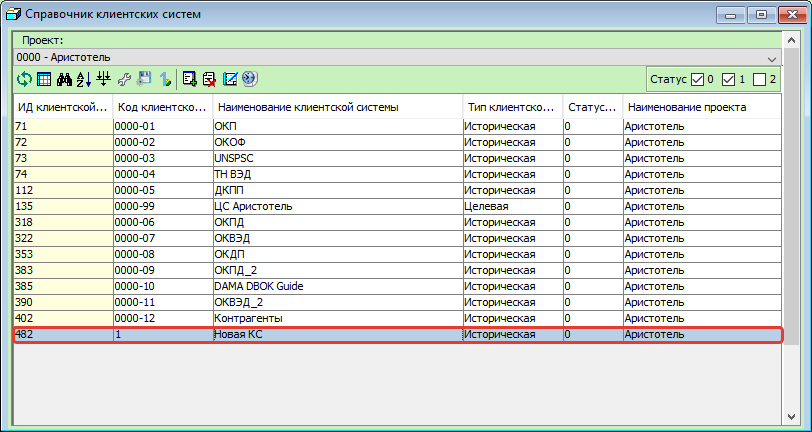
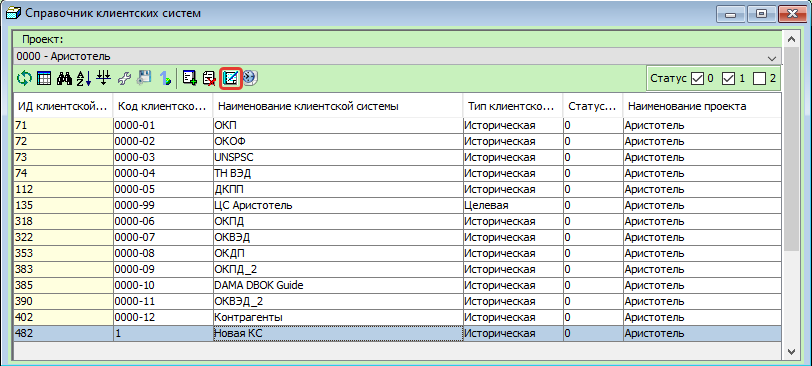

Инструкции по работе с объектами системы
========================================

.. |Добавить| image:: _static/icons/add.png
.. |Да| image:: _static/icons/yes.png
.. |Нет| image:: _static/icons/no.png
.. |Редактирование| image:: _static/icons/edit.png
.. |Удалить| image:: _static/icons/del.png

Справочник проектов
--------------------
В процессе подготовки структуры данных первой сущностью, которую необходимо создать, является проект.

Вызвать форму «Справочник проектов» |Проект| можно из **пункта меню** Объекты системы.

.. attention:: Кнопка |Проект| на **панели инструментов**, вызывает форму «Выбор проектов», а не форму «Справочник проектов»

Создание проекта
~~~~~~~~~~~~~~~~~
На форме «Справочник проектов» нажать кнопку «Добавить» |Добавить|, либо сочетание клавиш Ctrl+N.

.. image:: _static/screens/objects02.png

На открывшейся форме «Добавление проекта» обязательными для заполнения являются поля «**Наименование**» и «**Код**». 

Также возможно:

* установить **числовой разделитель** целой и дробной части числовых значений признаков проекта; 
 
* исключить **генерацию пробела** после точки в проекте;

* изменить **статус** проекта; 
  
* указать **дату актуальности** проекта;

* добавить **описание**. 

Поля «Дата создания», «Дата модификации» и «Автор модификации» заполняются автоматически.

.. image:: _static/screens/objects03.png

Для сохранения изменений нажать кнопку |Да|, для выхода из формы |Нет|.

Новый проект можно увидеть в списке проектов на форме «Справочник проектов».

.. image:: _static/screens/objects04.png

Редактирование проекта
~~~~~~~~~~~~~~~~~~~~~~~
Параметры ранее созданного проекта можно изменить на форме «Редактирование проекта», которую можно вызвать нажатием на кнопку  «Редактировать» |Редактирование|, либо сочетанием клавиш Ctrl+R  на форме «Справочник проектов», предварительно выделив строку с проектом.

.. image:: _static/screens/objects05.png

На открывшейся форме «Редактирование проекта» возможно:

* изменить **наименование проекта**; 
 
* изменить **код проекта**;

* установить **числовой разделитель** целой и дробной части числовых значений признаков проекта; 
 
* исключить **генерацию пробела** после точки в проекте;

* изменить **статус** проекта; 
  
* указать **дату актуальности** проекта;

* добавить **описание**. 
  
.. image:: _static/screens/objects06.png

Для сохранения изменений нажать кнопку |Да|, для выхода из формы |Нет|.

Удаление проекта
~~~~~~~~~~~~~~~~
Для **логического удаления** проекта необходимо нажать на кнопку «Удалить» |Удалить| либо клавишу Delete на форме «Справочник проектов», предварительно выделив строку с проектом.

.. image:: _static/screens/objects07.png

В открывшемся окне «Удаление проекта» нажать кнопку |Да| для логического удаления проекта, кнопку |Нет| для выхода из формы.

.. image:: _static/screens/objects08.png

.. note:: Альтернативный способ логического удаления доступен на форме «Редактирование проекта». Для этого необходимо изменить статус на «Заблокирован».

Для **физического удаления** проекта необходимо выбрать проекты со статусом 2 и нажать на кнопку «Удалить» |Удалить| либо клавишу Delete на форме «Справочник проектов», предварительно выделив строку с проектом.

Если проект содержит объекты, то появится предупреждение:

Для физического удаления проекта необходимо физически удалить все объекты данного проекта. После этого повторить процедуру удаления проекта. В открывшемся окне «Удаление проекта» нажать кнопку |Да| для физического удаления проекта, кнопку |Нет| для выхода из формы.

.. image:: _static/screens/objects10.png

.. attention:: При удалении проекта будут удалены шаблоны проекта, клиентские системы, проектное представление и проектные значения признаков. Восстановить данные объекты системы с помощью инструментов Классификатор 5.0 после физического удаления проекта невозможно.

Выбор проектов
~~~~~~~~~~~~~~
Для дальнейшей работы с проектом необходимо подключить данный проект для отображения на форме «Выбор проектов». Вызвать форму «Выбор проектов» |Проект| можно из пункта меню «Подключение».

Либо кнопкой «Выбор проектов» |Проект| на панели инструментов.

Справочник клиентских систем
-----------------------------

Клиентская система (КС)
     Функциональный параметр, используемый в процессе реализации проектной деятельности при загрузке проектных данных, необходим для отображения данных по отдельным заводам, филиалам и т.д.

По типу  КС делятся на исторические и целевые. Каждая историческая КС привязана к отдельному рабочему источнику данных (дочерние компании, филиалы, предприятия), а целевая КС отображает агрегированные данные с той перспективой, что все предприятия, участвующие в проекте будут  пользоваться представленными в целевой КС данными.

.. note:: Для каждого проекта создается минимум 2 КС: историческая и целевая . Историческая КС создается для каждого источника данных. Целевая система, как правило, создается одна. Наименование формируется с префиксом ЦС. Например, ЦС ТН.

Вызвать форму «Клиентская система» |Клиентская система| можно из пункта меню Объекты системы.

.. image:: _static/screens/objects12.png

Либо на форме «`Справочник проектов`_» нажать на кнопку «Клиентская система» |Клиентская система|, предварительно выделив строку с проектом.

Создание КС
~~~~~~~~~~~

На форме «Справочник клиентских систем» нажать кнопку «Добавить» |Добавить|, либо сочетание клавиш Ctrl+N.

.. image:: _static/screens/objects14.png

На открывшейся форме «Добавление клиентской системы» обязательными для заполнения являются поля «**Наименование**», «**Код**», «**Проект**», «**Тип клиентской системы**», «**Статус**». Также возможно указать «**Дату актуальности**» проекта. Поля «Дата создания», «Дата модификации» и «Автор модификации» заполняются автоматически.

.. note:: Код клиентских систем используется для внутреннего упорядочивания КС. Целевую КС лучше всего создавать с кодом 99. Таким образом, можно избежать исправления кодов из-за появления новых КС в процессе проработки и добиться выделения целевой КС как конечной КС.

.. image:: _static/screens/objects15.png

Для сохранения изменений нажать кнопку |Да|, для выхода из формы |Нет|.
 
Новую КС можно увидеть в списке клиентских систем на форме «Справочник клиентских систем».

.. attention:: Для дальнейшей работы с созданной КС необходимо подключить для отображения данную КС на форме «Выбор проектов».

Редактирование КС
~~~~~~~~~~~~~~~~~

Параметры ранее созданной клиентской системы можно изменить на форме «Редактирование клиентской системы», которую можно вызвать нажатием на кнопку  «Редактировать» |Редактирование|, либо сочетанием клавиш Ctrl+R на форме «Справочник клиентских систем», предварительно выделив строку с КС.

