Инструкция по работе с сервисом токенизации наименований объектов
==================================================================

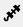
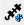
.. |ТокенЗн| image:: _static/icons/token-zn.png

.. |Excel| image:: _static/icons/xl.png
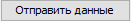
.. |Удалить| image:: _static/icons/del.png
.. |Comp| image:: _static/icons/comp.png

.. |slov| image:: _static/icons/slov.png

.. |sv1| image:: _static/icons/sv1.png
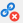
.. |work_with_obj| image:: _static/icons/work_with_obj.png
.. |deblock| image:: _static/icons/deblock.png

Токенизация 
 Это процесс разделения исходного текста на токены с преобразованиями.
Токены
 Это кусочки исходного текста, которые были подвержены некоторым преобразованиям.

Мы разделяем исходный (исторический) текст на кусочки, чтобы понять: какому ОД и значению ОД соответствует тот или иной кусочек исходного текста.
Этот процесс незаметно происходит в голове у эксперта, который разделяет исходный текст (равно обрабатывает), и понимает, какие части текста указывают на соответствующие значения ОД, а какие не указывают на значения ОД, и какие не указывают ни на что и являются своеобразным “мусором”. При этом эксперт может переставлять части текста местами, объединять и разделять их, устраняя неточности исходного текста.
Формализовав данный процесс, мы получили сервис токенизации наименований объектов, который учитывает набор и частоту встречаемости всех значений ОД в классе, а для обработанных объектов еще значения ОД этих объектов. 

Заполнение машинной и пользовательской токенизации
--------------------------------------------------

Прежде всего нам необходимо обучить модель на пользовательской токенизации. На форме «Справочник объектов» необходимо выделить все объекты класса со статусом 1, затем нажать кнопку «Токенизация наименования» |Токен|.

.. image:: _static/screens/token01.png

На форме «Токенизация наименования» мы наблюдаем таблицу в которой представлены:

* Наименование - исходный (исторический) текст.

* Машинная токенизация - текст из которого удаляются все символы кроме: пробела, точки, букв и цифр.

* Пользовательская токенизация - текст на основе которого будет происходить обучение модели. 
  
.. image:: _static/screens/token02.png

Далее необходимо запустить кнопку «Формирование словаря токенизации» |slov|. Кнопка запускает сбор статистики использования токенов по классу на основе пользовательской токенизации, в случае ее отсутствия анализирует машинную токенизацию. При нажатии кнопки выводится информационное сообщение «Статистика по классу пересобирается. Дождитесь информационного письма».

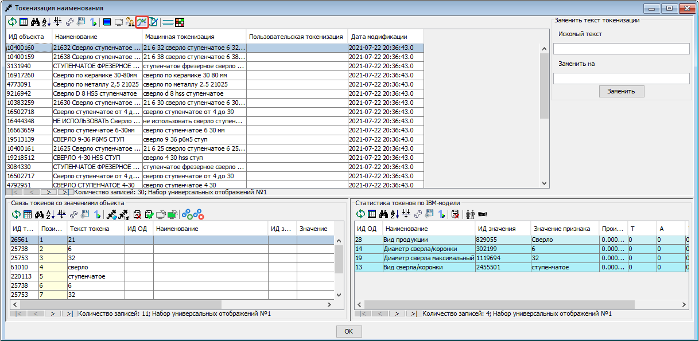

После получения по почте информационного письма заполняем или обновляем машинную токенизацию. Для этого необходимо выделить все объекты и нажать на кнопку «Заполнить машинную токенизацию» |mash| на панели инструментов. 

Затем заполняем пользовательскую токенизацию путем копирования машинной токенизации. Для этого необходимо выделить все объекты и нажать на кнопку «Заполнить пользовательскую токенизацию» |Заполнить пользовательскую токенизацию| на панели инструментов. 

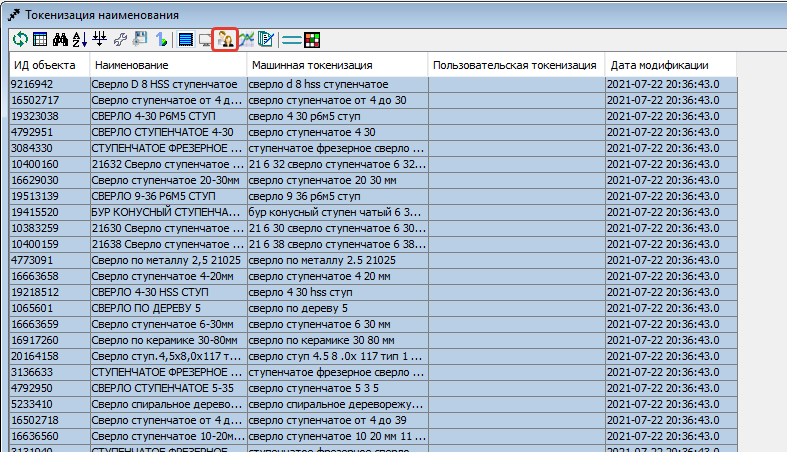

.. note:: Машинную токенизацию мы изменить не можем, она формируется автоматически. Пользовательскую токенизацию мы можем изменить, чтобы обучение модели происходило более эффективно (например убрать лишние данные в токенизированном наименовании, которые могут ошибочно влиять на процесс обучения, либо скорректировать данные).  Подробнее в разделе `Исправление токенизации`_.

Обучение модели на основе пользовательской токенизации
------------------------------------------------------

После заполнения пользовательской токенизации возвращаемся на форму «Справочник объектов» и на панели инструментов нажимаем на кнопку «Обучить IBM-модель для класса» |Comp|

На открывшейся форме «Работа с IBM-моделью» выбираем действие «**Обучить модель**» и тип токенизации «**Пользовательская токенизация**». Затем нажимаем на кнопку Отправить данные |Отправить данные|.

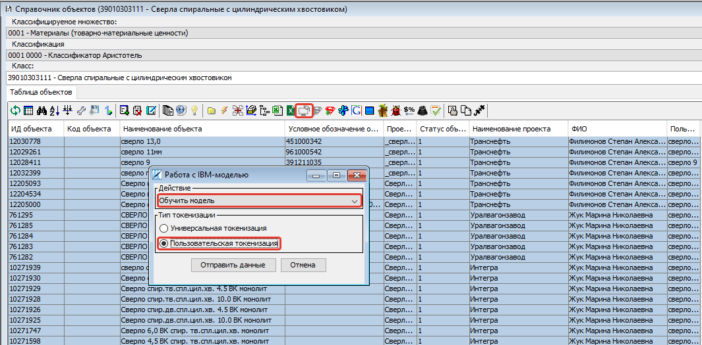

Ожидаем письмо об окончании обучения модели.

.. image:: _static/screens/token07.png

Далее на форме «Работа с IBM-моделью» выбираем действие «**Получить метрики**». Затем нажимаем на кнопку Отправить данные |Отправить данные|.

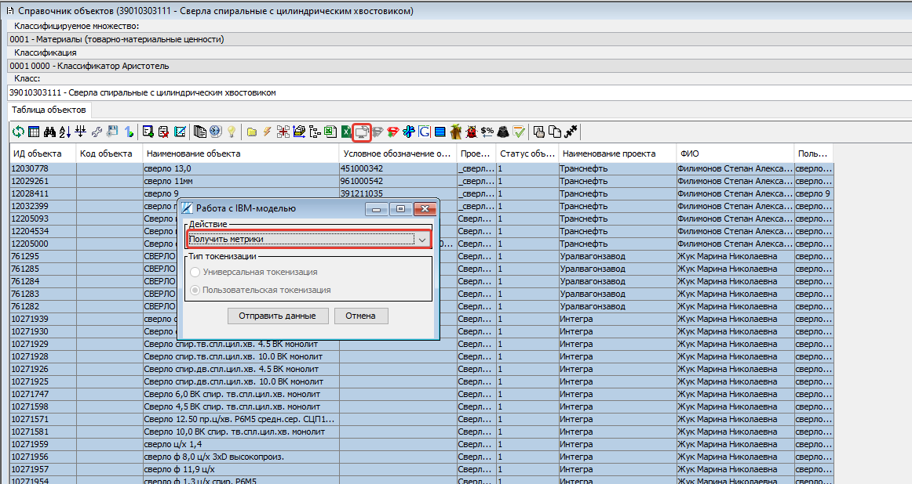

Ожидаем письмо об окончании подсчета метрик.

Заполнение связей между токенами и значениями ОД вручную
--------------------------------------------------------

Возвращаемся на форму «Токенизация наименования». Рассмотрим блоки которые расположены в нижней части формы. 

В блоке «Связь токенов зо значениями объекта» мы видим разделенный последовательно (попозиционно) на токены исходный текст объекта.

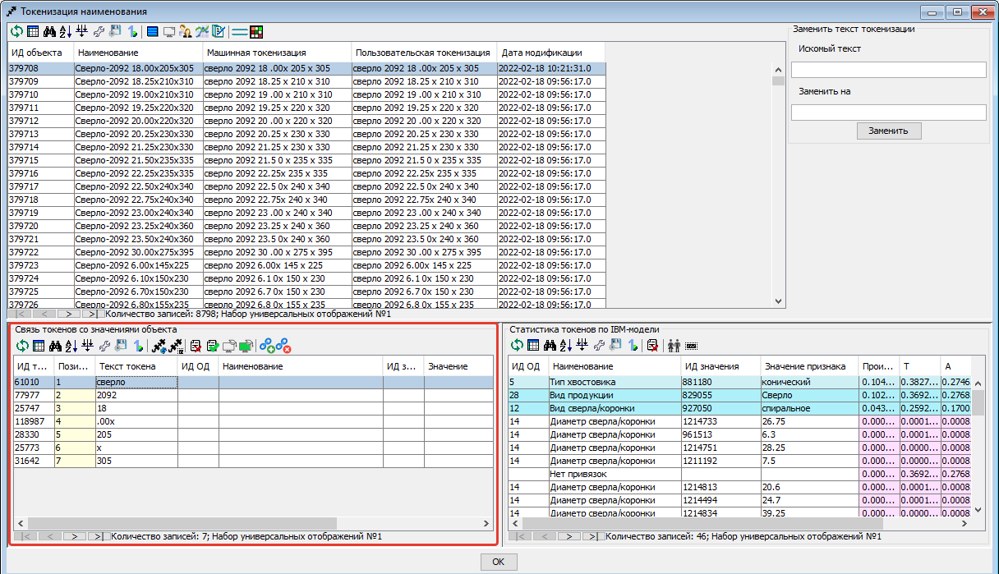

В блоке «Статистика токенов по IBM-модели» мы видим ОД, значения ОД и произведение трех вероятностей:

* T - вероятность совместной встречаемости токена и значения ОД;

* A - вероятность встречаемости значения ОД на данной позиции при заданной длине текста;

* V - вероятность появления данного значения ОД.
  
.. note:: Числа написаны в приближении до 10\ :sup:`-5`, т.е. если видим 0,00000 - это не ноль, а просто малое число.

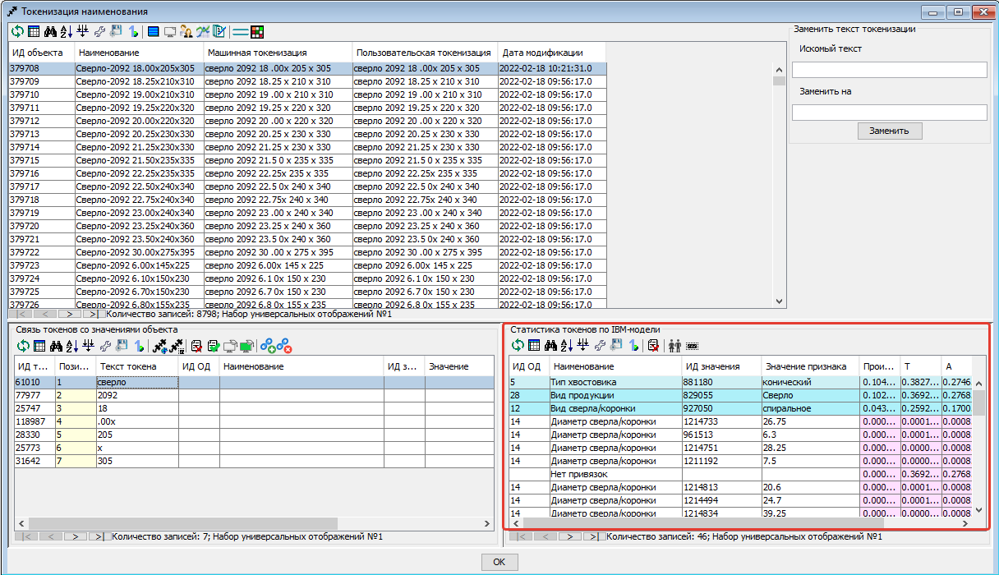

Значения расположены в порядке убывания произведения вероятностей. На основании данного произведения будет производиться автоматическое заполнение связей. Мы можем вручную перетащить строку со значением ОД из блока «Статистика токенов по IBM-модели» в блок «Связь токенов зо значениями объекта». При этом если объекту в выбранном ОД было присвоено другое значение, либо в выбранном ОД отсутствовало значение, то объекту будет присвоено выбранное значение ОД и создана соответствующая связь. 

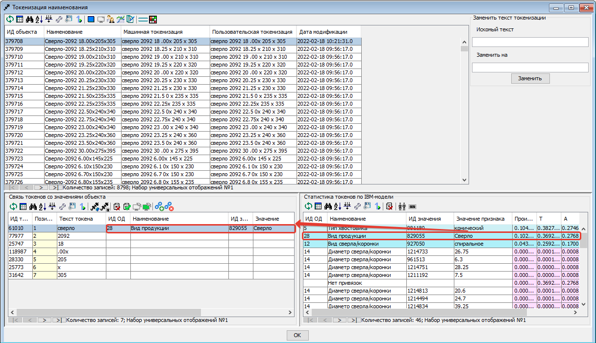

* Голубым цветом выделены поля которые соответсвуют ОД и значениям ОД присвоенным для объекта. 

* Белым цветом выведены поля с вероятными предлагаемыми значениями ОД, которые могут быть связаны с токеном.

Заполнение связей между токенами и значениями ОД автоматически
---------------------------------------------------------------

Автоматическое заполнения связей возможно попозиционно на форме «Токенизация наименования». Для этого необходимо выбрать объект и нажать на кнопку «Заполнить отсутсвующие связи на основе статистики» |Comp|. 

.. image:: _static/screens/token20.png

Чтобы заполнить связи сразу для всего класса необходимо перейти в функциональный модуль.

.. image:: _static/screens/token08.png

Запускаем функциональный модуль 2636 «Заполнение связей токенов со значениями объектов по классу»

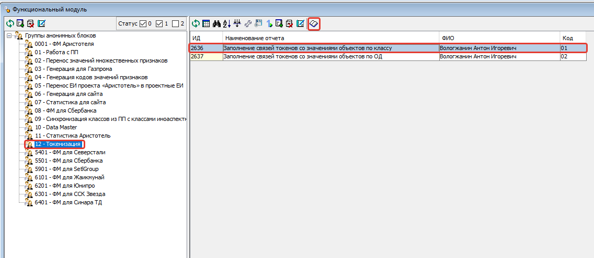

Заполняем значения параметров «Множество», «Классификация», «Класс», нажимаем кнопку «ОК»

.. image:: _static/screens/token10.png

Удаление лишних связей в разрезе ОД
-------------------------------------

После автоматического заполнения связей необходимо отвязать некорректные. Это можно сделать из формы «Основания деления класса», выделяем ОД и нажимаем кнопку «Токены, связанные с ОД», либо сочетание клавиш Ctrl+Shift+T

.. image:: _static/screens/token11.png

На открывшейся форме «Токены, связанные с ОД» мы видим таблицу на которой отображены **текст привязанного токена**, **количество связей** данного текста с объектами обучающей выборки, вхождение данного текста **в домен** выбранного основания деления (те токены которые полностью соотвествуют значению ОД отмечены символом "V"). 

Выделяем те связи которые мы считаем лишними и нажимаем кнопку «Удалить связь токена со значением ОД» |Удалить| либо клавишу Delete.

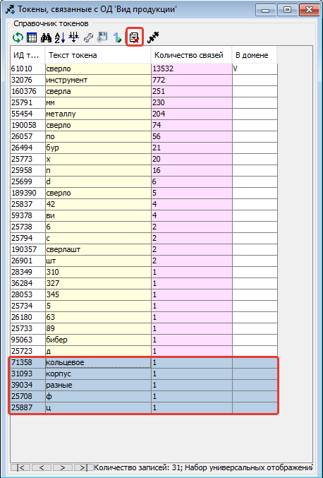

.. note::  Например для ОД "Вид продукции" можно сразу удалить все связи с числовыми токенами, т.к. они точно не указывают на вид продукции. Также связи с токенами отдельных букв и слов никак не связанных с видом продукции. А для ОД "Диаметр сверла" мы можем сразу удалить все нечисловые токены, т.к. они не могут указывать на диаметр.

Чтобы просмотреть объекты обучающей выборки которые привязаны к конкретному токену необходимо выделить его и нажать на кнопку «Открыть связаннные с токеном объекты» |Токен| на панели инструментов либо сочетание клавиш Ctrl+Shift+T.

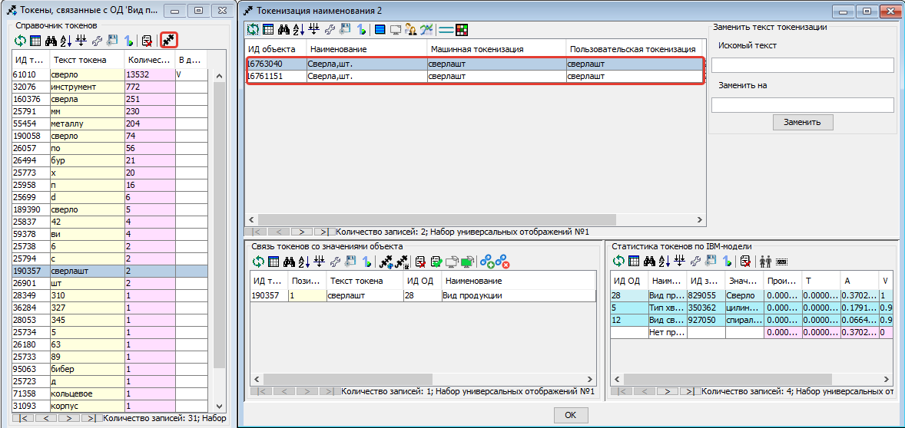

Удаление лишних связей в разрезе значений ОД
----------------------------------------------

Если домен значений ОД содержит небольшое количество значений, то следует отвязать неккоректные связи и на уровне значений. Для этого переходим на форму «Справочник значений ОД» и нажимаем на кнопку «Токены, связанные со значением ОД» |ТокенЗн| либо сочетание клавиш Ctrl+Shift+T, предварительно выделив строку с ОД.

.. image:: _static/screens/token14.png

На открывшейся форме «Токены, связанные со значением ОД» мы видим таблицу на которой отображены **текст привязанного токена**, **количесвто связей** данного текста с объектами обучающей выборки, **T** - вероятность совместной встречаемости токена и значения ОД. 

Выделяем те связи которые мы считаем лишними и нажимаем кнопку «Удалить связь токена со значениями ОД объекта» |Удалить| либо клавишу Delete.

.. image:: _static/screens/token36.png

.. note:: Корректными связями между токенами и значениями ОД являются только те, которые прямо указывают на это конкретное значение ОД, а не косвенно. Например, если токен соответструет длине и из него видно, что сверло длинной серии, то такую связь со значением "длинная серия" оставлять не нужно, она должна быть удалена. 

Чтобы просмотреть объекты обучающей выборки которые привязаны к конкретному тексту необходимо выделить его и нажать на кнопку «Открыть связаннные с токеном объекты» |Токен| на панели инструментов либо сочетание клавиш Ctrl+Shift+T.

.. image:: _static/screens/token41.png

.. note:: Перейдя на форму "Токенизация наименования" мы можем наблюдать, что хоть токен "хв" и имеет максимальное количество связей со значением "длинная серия", он не имеет к ней никакого отношения, соотвественно связь может быть удалена.

.. attention:: Каждый раз при внесени довольно большого количества изменений (изменения токенов, проставление и удаление связей) в токенизацию необходимо проводить `Обучение модели на основе пользовательской токенизации`_. Т.е. ее надо проводить как минимум перед началом всех работ, после чистки связей токенов со значениями ОД и после окончания работ по токенизации класса.

Создание прямых связей между токенами и значениями ОД
------------------------------------------------------

Прямая связь между токеном и значением ОД
 показывает, что если среди токенов объекта есть данный токен, то он однозначно определяет данное значение ОД, т.е. в рамках одного домена значений ОД токен может быть привязан только к одному значению.

Проставить прямую связь можно двумя способами.

1) На форме «Токены, связанные со значением ОД» которую можно открыть с формы «Справочник значений ОД» выделить необходимое поле и нажать на кнопку «Добавить прямую связь между токеном и значением ОД» |sv1|. Строка с прямой связью будет выделена зеленым цветом. Для удаления связи нажать на кнопку «Удалить прямую связь токена со значением ОД» |sv2|. 
   
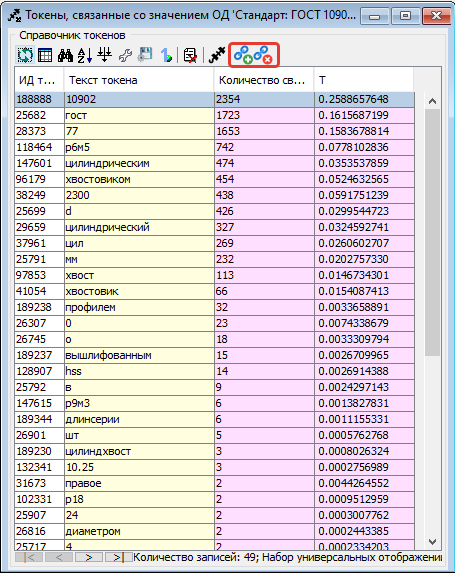

2) На форме «Токенизация наименования» выделить объект, также выделить связь на блоке «Связь токенов зо значениями объекта» и нажать на кнопку «Добавить прямую связь между токеном и значением ОД» |sv1|. Строка с прямой связью будет выделена зеленым цветом.  Для удаления связи нажать на кнопку «Удалить прямую связь токена со значением ОД» |sv2|. 

.. image:: _static/screens/token25.png

Когда в классе уже создано достаточное количество прямых связей можно ограничить заполнение отсутствующих связей на основе статистики только прямыми связями. Для этого в блоке «Связь токенов зо значениями объекта» необходимо нажать на кнопку «Заполнить отсутствующие прямые связи на основе статистики» |Comp_gr|.

.. image:: _static/screens/token29.png

Рассмотрим пример отношения 1:1 в рамках привязки токена к домену конкретного ОД:

.. note::   В домене ОД "Минимальное значение" есть числа -20 и 20, в домене ОД "Максимальное значение" только положительные числа. В исторических данных видим текст "-20..20", получаем токены 20 и 20. К первому токену 20 мы привяжем -20 из ОД "Минимальное значение" и к токену 20 мы привяжем 20 из ОД "Максимальное значение". В домене "Минимальное значение" токен 20 не дает однозначно понять какое значение привязать, т.к. в домене есть и -20 и 20. Мы поняли, что надо привязать -20 ориентируясь не только на ну информацию, что есть в токене, но и на упущенную в токене информацию, т.е. знак минус. Это значит, что прямую связь между токеном 20 и значением ОД "-20" мы поставить не можем. В домене "Максимальное значение" нет отрицательных чисел, токен 20 однозначно определяет значение 20. В рамках этого ОД связь однозначная, т.е. прямая. Но! Обратите внимание , что если мы увидим в данном классе токен "двадцать", который встречается только в 1-2 записях, и привяжем его к значению 20 в домене "Максимальное значение" прямую связь ставить не нужно, хоть токен и определяет значение однозначно. Данная прямая связь нарушит статистику токена 20 и приведет к ухудшению качества работы модели.

Другой пример:

.. note:: В классе "Молотки" токен "молоток" имеет прямую связь со значением ОД "Вид продукции" - "Молоток". Токены "кирочка", "кирка", "МКИ" и т.д. имеет прямую связь со значением ОД "Тип молотка" - "Кирочка". Токен "11042" имеет прямую связь со значением ОД "Стандарт" - "ГОСТ 11042", а токен "гост" останется без привязки к значению ОД, т.к. данный текст сам по себе не определяет никакое значение ОД. В ОД "Масса бойка,г" токен 600 будет иметь прямую связь со значеним ОД 600 и токен 0,6 будет иметь прямую связь со значением ОД 600, т.к. оба эти токена встречаются довольно часто и однозначно определяют значение 600 ОД "Масса бойка,г". При этом если в домене этого же ОД было бы значение 0,6, то токены 0,6 и 600 не имели бы прямой связи со значением 600 и значением 0,6, т.к. информацию о массе мы бы получали из упущенной в токене информации, т.е. единицы измерения кг или г.

Массовая обработка токенизированных наименований в разрезе значений ОД
----------------------------------------------------------------------

На форме «Токенизация наименования» возможно массовое создание, редактирование, удаление связей между токенами и значениями ОД. 

Для массового удаления связей необходимо выделить несколько объектов, также выделить связь на блоке «Связь токенов зо значениями объекта» и нажать кнопку "Удалить связь токена со значениями ОД объекта" |Удалить| на панели инструментов или в контекстном меню, либо нажать клавишу Delete.

.. image:: _static/screens/token22.png

Для массового создания связей нужно выделить несколько объектов и перетащить строку со значением ОД из блока «Статистика токенов по IBM-модели» в блок «Связь токенов зо значениями объекта».

.. image:: _static/screens/token23.png

Массовая обработка токенизированных наименований ограничена количеством объектов не более 1000. 

Обработка отсутствующих связей между токенами и значениями ОД
--------------------------------------------------------------

Для того чтобы модель обучалась более эффективно требуется корректировка фасетной классификации объектов, блокировка заполненных некорректных значений ОД объектов: 

* Значениям ОД прямо вытекающим из наименования, т.е. есть есть конкретные токены указывающие на значение, ставим vso=0 (обычно этот статус уже стоит по умолчанию);
* Значениям ОД взятым из компетентных источников (стандарты, сайты производителей), а также полного наименования или других дополнительных полей ставим vso=1;
* Значениям ОД взятым в результате доопределения заказчиком и статистическими методами ставим vso=2;
* Значения ОД которые по какой-либо причине не были заполнены заполняем. 
  
Редактирование объектов возможно с формы «Токенизация наименования». Для этого необходимо выделить объект или несколько объектов и нажать на кнопку «Редактирование классификации объектов» |work_with_obj| или сочетание клавиш Ctrl+Alt+C
  
.. image:: _static/screens/token27.png

Для удобства можно добавить в отображение столбец, в котором будут выведены ИД ОД, которые заполнены у объектов, но не имеют привязок к токенам:
::

     (SELECT LISTAGG(v.dvs_id, ', ') WITHIN GROUP (ORDER BY v.dvs_id)
     --LISTAGG(v.dvs_id  ': '  NVL(n.valchar, n.valnum), '; ') WITHIN GROUP (ORDER BY v.dvs_id)
     FROM vso v, vsn n
     WHERE v.mlt_id = :MLT_ID 
     AND v.clf_id = :CLF_ID 
     AND v.cls_id = :CLS_ID 
     AND v.status = 0
     AND v.vsn_id <> 0 
     AND v.obj_id = a.obj_id
     AND n.mlt_id = :MLT_ID
     AND n.sgn_id = v.sgn_id
     AND n.vsn_id = v.vsn_id
     AND NOT EXISTS (
       SELECT NULL 
       FROM vcl 
       WHERE mlt_id = v.mlt_id 
       AND clf_id = v.clf_id 
       AND cls_id = v.cls_id
       AND dvs_id = v.dvs_id
       AND sgn_id = v.sgn_id
       AND vsn_id = v.vsn_id
       AND obj_id = v.obj_id
       )
     )

Столбец можно добавить на форме «Настройка отображения», путем добавления функции на любой ненужный столбец отображения.

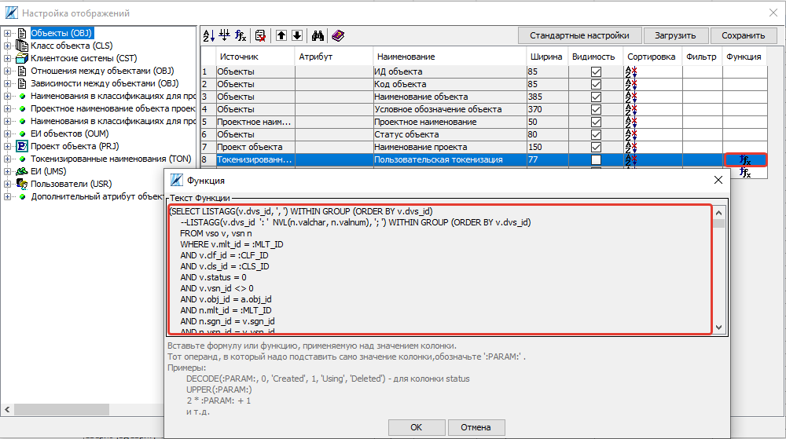

Деблокирование связей между токенами и значениями ОД
-----------------------------------------------------

Все обработанные связи должны быть деблокированы, таким образом мы понимаем, что класс закончен. Когда мы заполненяем связи между токенами и значениями ОД вручную, то статус автоматически изменяется на 1. Все связи которые присвоены автоматически мы должны проверить и либо отвязать, либо деблокировать.

Деблокирование связей происходит на форме «Токенизация наименования». Для этого необходимо выделить необходимую связь и нажать на кнопку «Деблокировать связь токена со значением объекта» |deblock|

.. image:: _static/screens/token38.png

Исправление токенизации
------------------------

Исправление токенизации возможно в режиме редактирования текста по одному объекту, в режиме замены по любому числу выделенных объектов или SQL-запросом к таблице TON.
По опыту тестирования инструмента основные операции в исправлении токенизации:

* возврат удаленного символа (часто это единица измерения после числа, которой нет в значениях ОД),

* разделение токенов (несколько слов могут быть слеплены в одно, например, из-за сокращений),

* объединение токенов (часть слова может быть отделена, так как сама является валидным токеном, либо значение ОД является диапазоном).

В целом важно понимать, что токенизированное наименование «стремится» к нормализованному.

Чтобы массово изменить тексты пользовательской токенизации используется блок «Заменить текст токенизации». В поле «Искомый текст» вводим текст который требует коррекции, в поле «Заменить на» обновленный текст. Далее выделяем записи в которых необходимо произвести замену и нажимаем кнопку «Заменить». 

.. image:: _static/screens/token16.png

Получение метрик
----------------

Для контроля эффективности выполненных работ разработан новый сервис «Получить метрики» - подсчет метрик по распознаванию значений ОД в классе. 

На форме «Справочник объектов» и на панели инструментов нажимаем на кнопку «Обучить IBM-модель для класса» |Comp|

На открывшейся форме «Работа с IBM-моделью» выбираем действие «**Получить метрики**». Затем нажимаем на кнопку Отправить данные |Отправить данные|.

Ожидаем письмо об окончании подсчета метрик.

.. attention:: Не стоит при каждом изменении данных смотреть метрики. Необходимо сделать подсчет в начале работы и после окончания работы над классом. 

Заполнение связей токенов со значениями объектов по ОД
------------------------------------------------------

Существует возможность автоматического заполнения связей токенов со значениями объектов не для всего класса, а для конкретного ОД. Для этого переходим в функциональный модуль и запускаем модуль 2637 «Заполнение связей токенов со значениями объектов по ОД»

.. image:: _static/screens/token34.png

Заполняем значения параметров «Признак», «Основание деления», «Множество», «Классификация», «Класс» нажимаем кнопку «ОК»

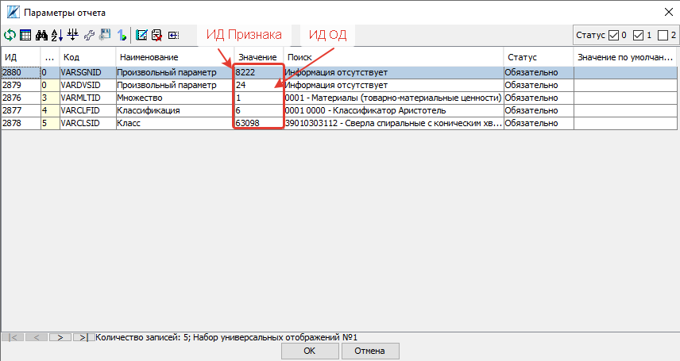

Необходимость данного модуля может возникнуть в ситуации, когда мы уже поработали с классом, а затем обнаружили необходимость в изменении или создании связей конкретного ОД. Например в классе было призведено изменение структуры и один ОД был разделен на два или добавлен новый. Либо была обнаружена ошибка и часть связей были зря удалены. В таком случае мы не хотим трогать все ОД которые уже были почищенны и можем автоматически проставить связи только для конкретного ОД.
